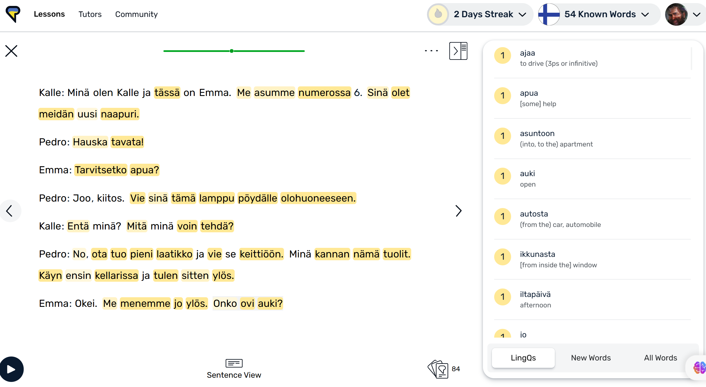
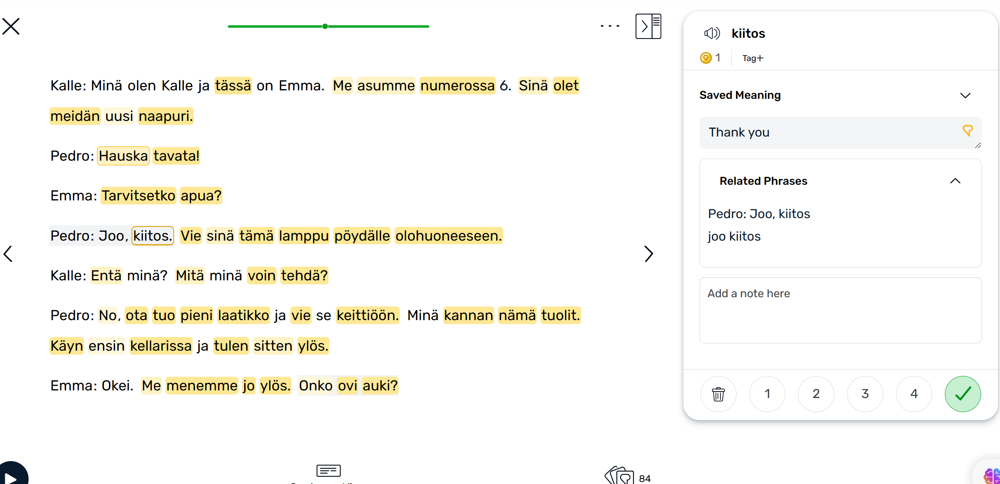
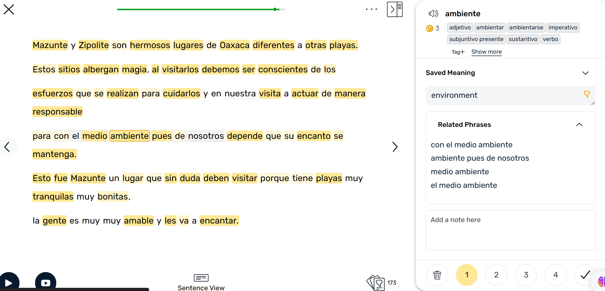
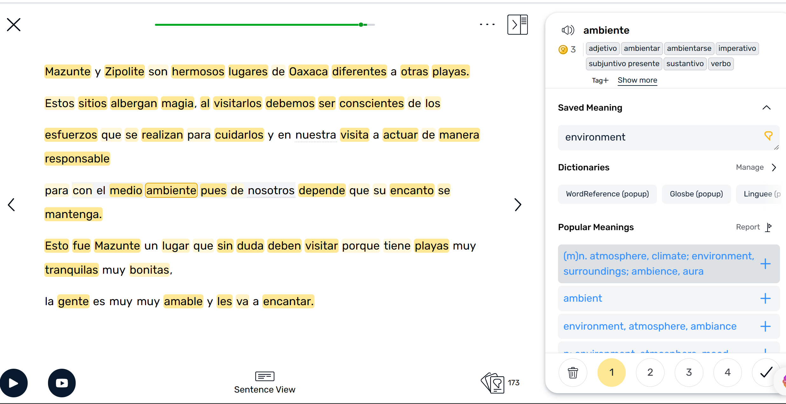
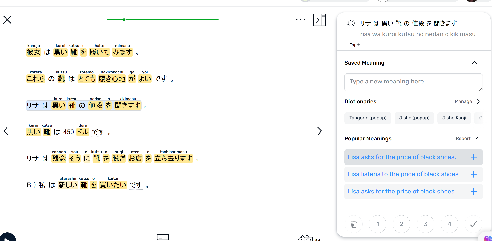
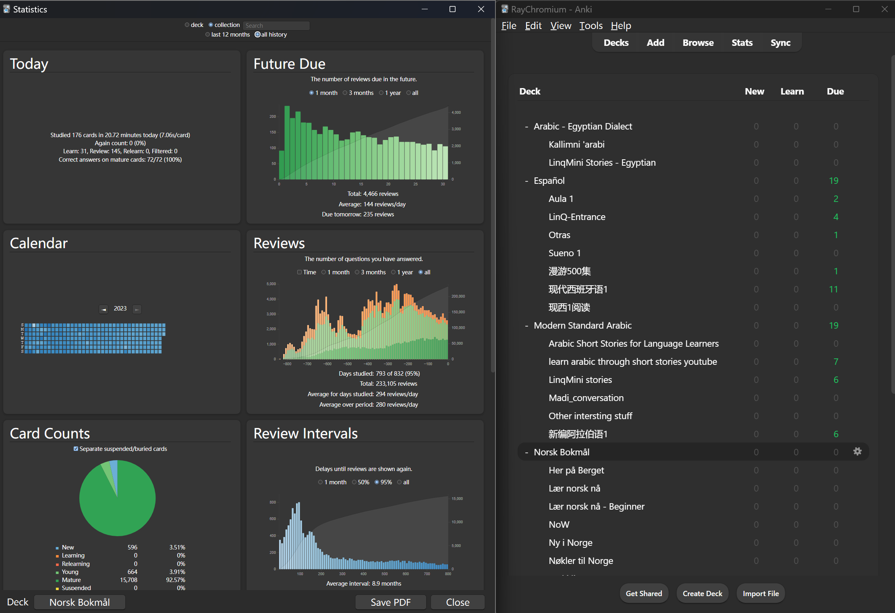
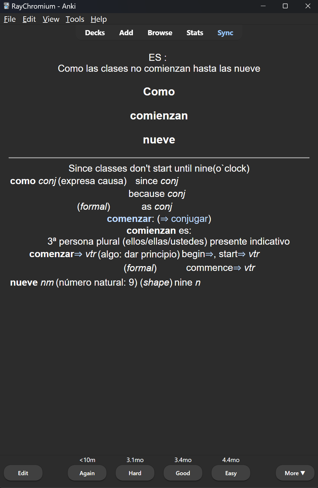
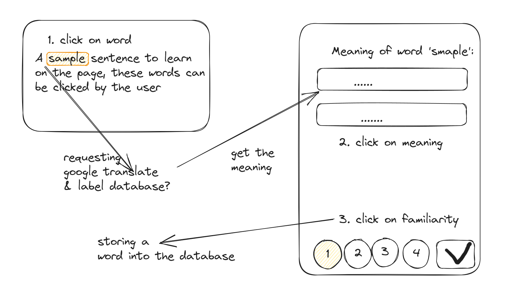
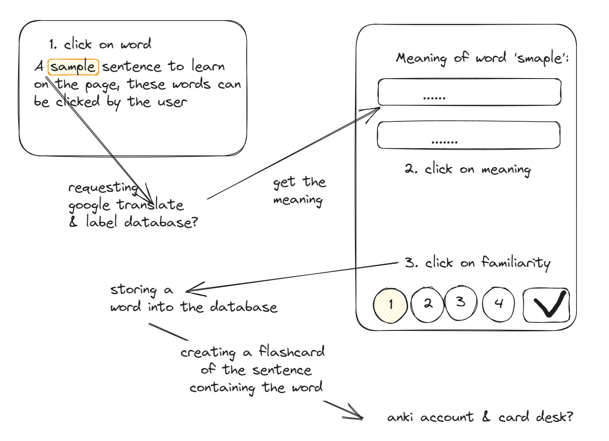
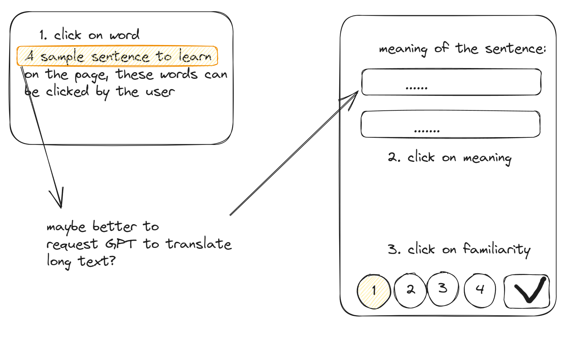

## ideas
  
Just rambling what I can think of now.
  
### word tagging and flashcard app?  
  
I have been learning languages using **LingQ** for a while, it looks like this: 

  
  
  
  
  
  

  

  
  
  
  
  
### Problems / To improve  
  
1. Need to switch between LingQ and Anki to create flash cards  
2. sentence translation not so accurate / has length limit within 9 words  
  
### Guessing the implementation?  
  
  
  

  
  
[creating anki cards via api](https://github.com/FooSoft/anki-connect)