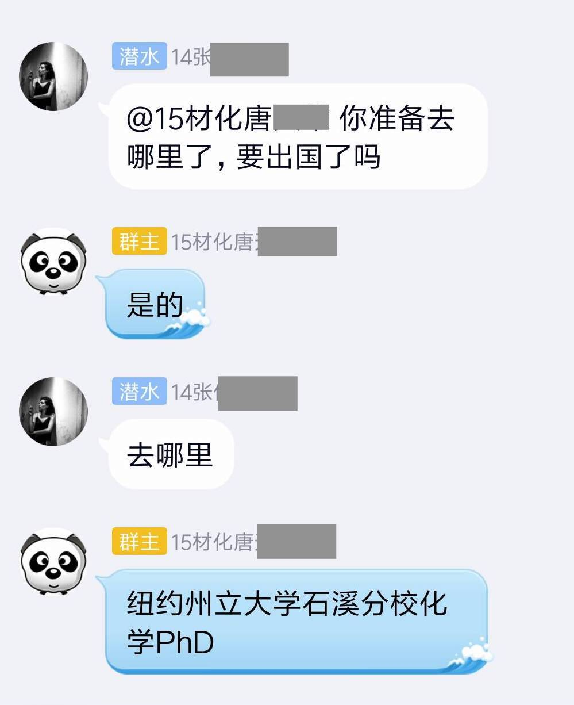

### 不工作
##### 起草人：蔡睿
第一种去向是**不工作**，乍一听似乎非常five，实际上这是难度最大、门槛也最高的神仙操作。
我身边就有这样的例子：在中学时代和我一起组乐队的一位哥们家里是湛江市经济作物种植业的大佬，全市超过80%的行道树是他们家种的……此人家里在广州、湛江、深圳总计有6、7套房产，家人给了他两套房产的处分权，他现在每个月光靠收房租就能过上比较轻松的生活了
这位同学是广东工业大学的桥梁工程本科生，然而他并不打算在毕业后去做和专业相关的工作。他在大学仍然积极参与乐队演出，现在偶尔在广州通利琴行分部教学，通过乐队演出和房租所带来的可观就已经满足了他的日常所需

为什么要将这种看似“非主流”的去向先拿出来说呢？课堂上也已经重点介绍过，了解自己的价值观和兴趣爱好是非常重要的。比如，这为不工作的同学本可以选择利用家里的资源去牟取更大的利益（不管是延续家业还是搞点投资还是去创业，估计怎么着也比整天卖力地演出和教学强），但是他对自己的价值取向有着深刻的理解，所以选择了玩音乐虽然这种赚不了什么钱但是自己喜欢的生活方式。
当然，现实中并不是每个人都有条件做出这样令人满意的选择，但我们通过这个例子想要传达的是：不论你自己想要怎么过日子，不管这种价值观是否为大众所接受，只要不犯法不杀人放火你就不应该为此感到惭愧

### 考研

### 出国升学/就业
##### 起草人：蔡睿
实例：今年毕业的兰州大学2015级物理院材料化学专业唐某某学长，准备去做纽约州立大学石溪分校化学PhD。
唐学长在2016年（大一下）通过自主选择从物理学大类分流到了材料化学专业，但不久后便对材料化学专业在国内严峻的就业形势有了深刻的了解……
“当时真的挺绝望的，差点自暴自弃了，”唐学长说，“但是仔细想想又太亏……我都已经努力了这么多年了，难道都白费了吗？选择真的比努力更重要。”在大一暑假，唐学长决定读研，因为他觉得以他的专业，去工业界的待遇大概率是比不上留在学术界的。于是他加倍努力，经常参与一些项目，再后来也以第一作者的身份发了一些文章，成为了他日后申请直博的筹码。
“最终决定出国还是因为待遇的问题吧，反正留在国内，读完硕士再工作的话待遇很可能也不会好到哪里去，那我还不如去做PhD，不但有点工资花花，说不定还能争取到留在学术界的机会。也许以后国内生化环材研究人员的待遇提高之后我也会回来的。”

虽然唐学长的看法也许有一定的偏见，但不可否认的是他确实对自己的专业进行了比较详细的了解，并选择了他所认为的利益最大化的去路。

### 工作（企业）

### 创业

### 公务员/事业单位